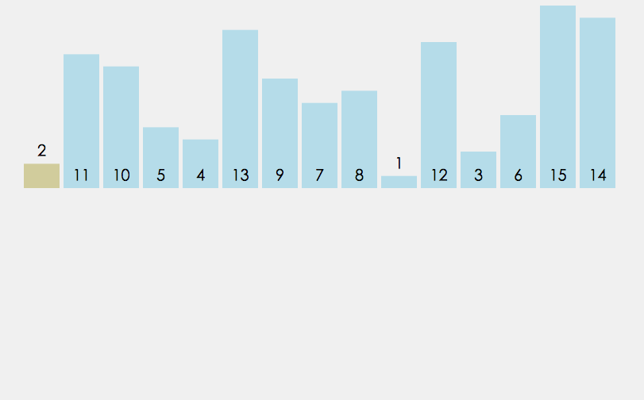

# Array类型

ECMAScript中的数组都是数据的有序列表，但与其他语言不同的是，ECMAScript数组的每一项可以保存任何类型的数据。也就是说，可以用数组的第一个位置来保存字符串，用第二位置来保存数值，用第三个位置来保存对象，以此类推。而且，ECMAScript数组的大小是可以动态调整的，即可以随着数据的添加自动增长以容纳新增数据。

[API参考链接](https://developer.mozilla.org/zh-CN/docs/Web/JavaScript/Reference/Global_Objects/Array)

## 创建

创建Array实例的方式有两种。

1.使用 new 操作符

```javascript
let arr = new Array();
```

在实例化的方法中，只有一个参数并且是数字类型，则会创建由 undefined 填充且长度为数字大小的数组。

```javascript
let initArr = new Array(1);

// 但是上面的方式在使用数组的方法时不会进行循环，需要借助下面的方式
let initOtherArr = Array.apply(null, {length : 5});

initOtherArr.map(console.log);
```

也可以传多个参数，作为数组的初始值。多个参数用 `,` 隔开

```javascript
let initArr = new Array(1, 2, 3);
```

2.对象字面量

```javascript
let initArr = [1, 2, 3];
```

## 取值

使用 `[]` 操作符。前面是是对象，里面对应值的索引。

```javascript
let initArr = [1, 2, 3];

num = initArr[1];
```

数组有个 `length` 属性，代表着数组的长度。如果对 length 进行修改，也会影响到原数组（修改后的值必须是数字正整数）。

如果修改后的大于原有的 length 。 多出来的大小个数的 undefined 填充原数组。

如果修改后的小于原有的 length 。 原数组即为修改后的长度，多出来的将会被删除。

```javascript
let initArr1 = [1, 2, 3];
initArr1.length = 4;

let initArr2 = [1, 2, 3];
initArr2.length = 1;
```

## 数组的检测

1. 使用 es6 的 `Array.isArray()` 方法。
2. 使用 `Object.prototype.toString.call(x) === '[object Array]'`

## 数组相关问题

### 数组去重

首先创建包含多个随机数的数组

```javascript

function createRandomArray(len) {
    let arr = [];

    for(;len--; arr.push(Math.floor(Math.random() * 10)));

    return arr;
}

let arr = createRandomArray(100);
```

方法一：

利用数组的 sort 方法将数组中相同的项聚集到一起。然后对比当前项和下一个是否相同，不同的推入到一个新的数组中。

```javascript
let sortArray = arr.sort((a, b) => a - b);

let pureArray = [];

for(let i = 0, len = arr.length; i < len; i++) {
    sortArray[i] !== sortArray[i+1] && pureArray.push(sortArray[i]);
}

```

方法二：

在一个新的空数组中判断当前数组的每一项是否存在，不存在，则推入。

```javascript
let pureArray = [];

for(let i = 0, len = arr.length; i < len; i++) {
    !~pureArray.indeOf(arr[i]) && pureArray.push(arr[i])
}
```

方法三：

维护一个对象，为数组每一项做标记即：属性为key ，值为 true。循环原数组，如果不存在则在对象中进行标记并推入到新的数组中，如果存在则跳过。

```javascript
let existKeyMap = {};
let pureArray = [];

for(let i = 0, len = arr.length; i < len; i++) {
    if (!existKeyMap[arr[i]]) {
        existKeyMap[arr[i]] = true;
        pureArray.push(arr[i])
    }
}
```

方法四：

ES6 提供了新的数据结构 Set。它类似于数组，但是成员的值都是唯一的，没有重复的值。

```javascript
let pureArray = [...new Set(arr)];
```

### 随机打乱数组

```javascript
let arr = [];

for (let i = 0; i < 100; arr.push(i++));

function upsetArray(orderArr) {
    let len = orderArr.length;
    let tmp;
    let randomNum;
    while(len) {
        randomNum = Math.floor(Math.random() * len);
        tmp = orderArr[randomNum];

        len--;
        orderArr[randomNum] = orderArr[len];
        orderArr[len] = tmp;
    }
}
```

### 数组排序

首先创建包含多个随机数的数组

```javascript

function createRandomArray(len) {
    let arr = [];

    for(;len--; arr.push(Math.floor(Math.random() * 10)));

    return arr;
}

let arr = createRandomArray(100);
```

方法一 **冒泡排序**

示意图：


code:

```javascript

function bubblSort(arr) {
    let tmp;
    let len = arr.length;
    let maxPos = 0;
    for (var i = len; i > 1; i--) {
        for (let j = 0; j < i; j++) {
            if (arr[j] > arr[j + 1]) {
                tmp = arr[j];
                arr[j] = arr[j + 1];
                arr[j + 1] = tmp;
                maxPos = j + 1;
            }
        }

        maxPos < i && (i = maxPos + 1);
    }
}

```

方法二 **插入排序**

示意图：



code:

```javascript

function insertSort(arr) {
    let tmp;
    let len = arr.length;
    for (let i = 1; i < len; i++) {
        let j = i;
        while (j--) {
            let left = arr[j];
            let right = arr[j + 1];

            if (left > right) {
                [arr[j], arr[j + 1]] = [arr[j + 1], arr[j]]
            }

        }
    }
}

```

方法三 **快速排序**

示意图：


code:

```javascript

let swap = (arr, storeIndex, right) => {
    [arr[right], arr[storeIndex]] = [arr[storeIndex], arr[right]]
};

let quickSort = arr => {
    let len = arr.length;

    let sort = (arr, left, right) => {
        if (left < right) {
            var compareVal = arr[left];
            var i = left;
            var j = right + 1;

            while (true) {
                while (i < right) {
                    // 如果 数组中 包含多个相同的值 ，对相等的值进行交换，可以减少 quickSort 的递归次数，所以这里的条件是 >=
                    if (arr[++i] >= compareVal) break;
                }

                while (j > left) {
                    if (arr[--j] <= compareVal) break;
                }

                if (i >= j) break;

                swap(arr, i, j);
            }

            swap(arr, left, j);

            sort(arr, left, j - 1);
            sort(arr, j + 1, right);
        }
    }

    sort(arr, 0, len -1);
}
```